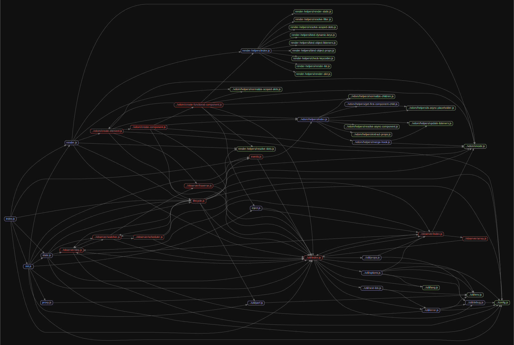

# 源码分析

## 文件结构

``` bash
/Users/liufang/openSource/FunnyLiu/vue
├── BACKERS.md
├── LICENSE
├── README.md
├── benchmarks
├── dist
├── examples
├── flow
├── package.json
├── packages
|  ├── vue-server-renderer
|  ├── vue-template-compiler
|  ├── weex-template-compiler
|  └── weex-vue-framework
├── scripts
├── src
|  ├── compiler - 与模板编译相关的代码
|  |  ├── codeframe.js
|  |  ├── codegen
|  |  |  ├── events.js
|  |  |  └── index.js - 代码生成器，将ast生成vnode的render函数执行字符串，给render函数
|  |  ├── create-compiler.js
|  |  ├── directives
|  |  |  ├── bind.js
|  |  |  ├── index.js
|  |  |  ├── model.js
|  |  |  └── on.js
|  |  ├── error-detector.js
|  |  ├── helpers.js
|  |  ├── index.js - 模板编译入口文件，使用parser/index.js从模板提取AST，经过optimizer.js优化标识静态节点，最后通过codegen/index.js生成render函数执行的字符串
|  |  ├── optimizer.js - 优化器，标识静态节点，方便patch阶段diff优化掉过
|  |  ├── parser
|  |  |  ├── entity-decoder.js
|  |  |  ├── filter-parser.js - 过滤器解析器，负责{{}}
|  |  |  ├── html-parser.js - html解析器，解析标签，使用text-parser解析文本
|  |  |  ├── index.js - 模板解析器入口文件，将模板变为AST，调用html-parser.js，最后生成AST
|  |  |  └── text-parser.js - 文本解析器，负责文本节点和属性提取
|  |  └── to-function.js
|  ├── core - 通用的、与运行平台无关的运行时代码
|  |  ├── components - 内置组件的代码
|  |  |  ├── index.js
|  |  |  └── keep-alive.js - keep-alive组件实现
|  |  ├── config.js
|  |  ├── global-api - 全局api的代码，比如Vue.set/Vue.nextTick等等
|  |  |  ├── assets.js - 定义Vue.component,Vue.directive,Vue.filter
|  |  |  ├── extend.js - 定义Vue.extend
|  |  |  ├── index.js
|  |  |  ├── mixin.js - 定义Vue.mixin
|  |  |  └── use.js - 定义Vue.use
|  |  ├── index.js
|  |  ├── instance - Vue.js实例的构造函数和原型方法，也就是Vue对象本身
|  |  |  ├── events.js - 提供initEvents，负责初始化事件绑定
|  |  |  ├── index.js - new Vue的入口文件
|  |  |  ├── init.js - 初始化的逻辑，包含了initLifecycle、initEvents、initRender、initInjections、initState、initProvide等多个初始化过程
|  |  |  ├── inject.js - 提供initInjections，初始化inject
|  |  |  ├── lifecycle.js - 提供initLifecycle，初始化生命周期过程
|  |  |  ├── proxy.js - 提供代理函数，方便部分私有属性挂载到vm
|  |  |  ├── render-helpers
|  |  |  |  ├── bind-dynamic-keys.js
|  |  |  |  ├── bind-object-listeners.js
|  |  |  |  ├── bind-object-props.js
|  |  |  |  ├── check-keycodes.js
|  |  |  |  ├── index.js
|  |  |  |  ├── render-list.js
|  |  |  |  ├── render-slot.js
|  |  |  |  ├── render-static.js
|  |  |  |  ├── resolve-filter.js
|  |  |  |  ├── resolve-scoped-slots.js
|  |  |  |  └── resolve-slots.js
|  |  |  ├── render.js - 提供initRender，负责挂载渲染相关方法
|  |  |  └── state.js - 提供initState，负责初始化props/methods/data/computed/watch
|  |  ├── observer - 实现变化侦测的代码
|  |  |  ├── array.js - hack的数组方法，用来给watcher通信来完成可观察对象的转换
|  |  |  ├── dep.js - 专门负责收集依赖的类Dep
|  |  |  ├── index.js - 提供Observer实例，对需要的object，通过defineProperty递归的建立可观察对象；对需要的数组，通过array.js提供的方法对数组原型进行hack复写，并植入观察逻辑
|  |  |  ├── scheduler.js - 处理watchers队列，通过nextTick批量处理
|  |  |  ├── traverse.js
|  |  |  └── watcher.js - 给vm和observer之间进行桥接的数据更新依赖者
|  |  ├── util
|  |  |  ├── debug.js
|  |  |  ├── env.js
|  |  |  ├── error.js
|  |  |  ├── index.js
|  |  |  ├── lang.js
|  |  |  ├── next-tick.js - nextTick的实现，从promise、MutationObserver、setImmediate、setTimeout依次降级
|  |  |  ├── options.js - mixin依赖的 mergeOptions 方法的具体实现，
|  |  |  ├── perf.js
|  |  |  └── props.js
|  |  └── vdom - 实现virtual dom的代码
|  |     ├── create-component.js
|  |     ├── create-element.js
|  |     ├── create-functional-component.js
|  |     ├── helpers
|  |     |  ├── extract-props.js
|  |     |  ├── get-first-component-child.js
|  |     |  ├── index.js
|  |     |  ├── is-async-placeholder.js
|  |     |  ├── merge-hook.js
|  |     |  ├── normalize-children.js
|  |     |  ├── normalize-scoped-slots.js
|  |     |  ├── resolve-async-component.js
|  |     |  └── update-listeners.js
|  |     ├── modules
|  |     |  ├── directives.js
|  |     |  ├── index.js
|  |     |  └── ref.js
|  |     ├── patch.js - patch阶段实现，包含了diff算法的具体过程和vnode转为真实dom的操作
|  |     └── vnode.js - VNode的描述class
|  ├── platforms - 特定平台运行时代码
|  |  ├── web
|  |  |  ├── compiler
|  |  |  |  ├── directives
|  |  |  |  |  ├── html.js
|  |  |  |  |  ├── index.js
|  |  |  |  |  ├── model.js
|  |  |  |  |  └── text.js
|  |  |  |  ├── index.js
|  |  |  |  ├── modules
|  |  |  |  |  ├── class.js
|  |  |  |  |  ├── index.js
|  |  |  |  |  ├── model.js
|  |  |  |  |  └── style.js
|  |  |  |  ├── options.js
|  |  |  |  └── util.js
|  |  |  ├── entry-compiler.js
|  |  |  ├── entry-runtime-with-compiler.js - 运行时+编译
|  |  |  ├── entry-runtime.js - 仅运行时
|  |  |  ├── entry-server-basic-renderer.js
|  |  |  ├── entry-server-renderer.js
|  |  |  ├── runtime
|  |  |  |  ├── class-util.js
|  |  |  |  ├── components
|  |  |  |  |  ├── index.js
|  |  |  |  |  ├── transition-group.js
|  |  |  |  |  └── transition.js
|  |  |  |  ├── directives
|  |  |  |  |  ├── index.js
|  |  |  |  |  ├── model.js
|  |  |  |  |  └── show.js
|  |  |  |  ├── index.js
|  |  |  |  ├── modules
|  |  |  |  |  ├── attrs.js
|  |  |  |  |  ├── class.js
|  |  |  |  |  ├── dom-props.js
|  |  |  |  |  ├── events.js
|  |  |  |  |  ├── index.js
|  |  |  |  |  ├── style.js
|  |  |  |  |  └── transition.js
|  |  |  |  ├── node-ops.js
|  |  |  |  ├── patch.js
|  |  |  |  └── transition-util.js
|  |  |  ├── server
|  |  |  |  ├── compiler.js
|  |  |  |  ├── directives
|  |  |  |  |  ├── index.js
|  |  |  |  |  ├── model.js
|  |  |  |  |  └── show.js
|  |  |  |  ├── modules
|  |  |  |  |  ├── attrs.js
|  |  |  |  |  ├── class.js
|  |  |  |  |  ├── dom-props.js
|  |  |  |  |  ├── index.js
|  |  |  |  |  └── style.js
|  |  |  |  └── util.js
|  |  |  └── util
|  |  |     ├── attrs.js
|  |  |     ├── class.js
|  |  |     ├── compat.js
|  |  |     ├── element.js
|  |  |     ├── index.js
|  |  |     └── style.js
|  |  └── weex
|  ├── server
|  ├── sfc - 单文件组件的解析代码
|  |  └── parser.js
|  └── shared - 项目用到的公共代码
|     ├── constants.js
|     └── util.js
├── types - typescript声明文件
└── yarn.lock

directory: 111 file: 531

ignored: directory (2)

```

## 框架整体生命周期


首先是[Vue的初始化](https://github.com/FunnyLiu/vue/tree/readsource#%E7%BB%84%E4%BB%B6%E7%9A%84%E7%94%9F%E5%91%BD%E5%91%A8%E6%9C%9F)，在其生命周期过程中，对[数据进行监听](https://github.com/FunnyLiu/vue/tree/readsource#%E6%95%B0%E6%8D%AE%E8%A7%82%E5%AF%9F)，对[模板进行编译](https://github.com/FunnyLiu/vue/tree/readsource#%E6%A8%A1%E6%9D%BF%E7%9A%84%E7%BC%96%E8%AF%91%E8%BF%87%E7%A8%8B)生成给render函数的字符串。通过render函数，进入patch阶段，进行[VNode的diff](https://github.com/FunnyLiu/vue/tree/readsource#vnode%E7%9A%84%E6%9B%B4%E6%96%B0%E6%B5%81%E7%A8%8B)以及生成真正的dom进行挂载。

### 模板的编译过程


编译compiler(src/compiler/index.js) 分为三个阶段：

1.模板解析阶段(src/compiler/parser/index.js)：将一堆模板字符串用正则等方式解析成抽象语法树AST；

2.优化阶段(src/compiler/optimizer.js)：遍历AST，找出其中的静态节点，并打上标记；方便Patch阶段的diff算法直接跳过静态节点；

3.代码生成阶段(src/compiler/codegen/index.js)：将AST转换成渲染函数；直接生成render函数需要的函数字符串

### 数据观察


通过Observer(src/core/observer/dep.js)，对需要的object，通过defineProperty递归的建立可观察对象；对需要的数组，通过array.js提供的方法对数组原型进行hack复写，并植入观察逻辑。

Dep用来负责依赖的收集(src/core/observer/dep.js)。

Watcher(src/core/observer/watcher.js),给vm和observer之间进行桥接的数据更新依赖者。

每当观察者需要更新时，通知各Watcher，在scheduler(src/core/observer/scheduler.js)中，处理watchers队列，通过nextTick批量处理。

#### Watcher 和 Dep 的关系

watcher 中实例化了 dep 并向 dep.subs 中添加了订阅者,dep 通过 notify 遍历了 dep.subs 通知每个 watcher 更新。

**依赖收集**

initState 时,对 computed 属性初始化时,触发 computed watcher 依赖收集

initState 时,对侦听属性初始化时,触发 user watcher 依赖收集

render()的过程,触发 render watcher 依赖收集

re-render 时,vm.render()再次执行,会移除所有 subs 中的 watcer 的订阅,重新赋值。


**派发更新**

组件中对响应的数据进行了修改,触发 setter 的逻辑

调用 dep.notify()

遍历所有的 subs（Watcher 实例）,调用每一个 watcher 的 update 方法。

#### 对象的观察


#### 数组的观察


对数组的方法进行原型覆盖(src/core/observer/array.js)，从而hack在过程中对依赖通知。


### VNode的更新流程


VNode(src/core/vdom/vnode.js)最大的用途就是在数据变化前后生成真实DOM对应的虚拟DOM节点。

然后就可以对比新旧两份VNode，找出差异所在，然后更新有差异的DOM节点。

最终达到以最少操作真实DOM更新视图的目的。

Diff算法位于(src/core/vdom/patch.js)。

patch无非就是干三件事：

1、创建节点：新的VNode中有而旧的oldVNode中没有，就在旧的oldVNode中创建。

2、删除节点：新的VNode中没有而旧的oldVNode中有，就从旧的oldVNode中删除。

3、更新节点：新的VNode和旧的oldVNode中都有，就以新的VNode为准，更新旧的oldVNode。

其中在更新新老子节点时会出现四种情况:

1.创建子节点

如果newChildren里面的某个子节点在oldChildren里找不到与之相同的子节点
那么说明newChildren里面的这个子节点是之前没有的，是需要此次新增的节点，那么就创建子节点。

2.删除子节点

如果把newChildren里面的每一个子节点都循环完毕后，发现在oldChildren还有未处理的子节点，
那就说明这些未处理的子节点是需要被废弃的，那么就将这些节点删除。

3.移动子节点

如果newChildren里面的某个子节点在oldChildren里找到了与之相同的子节点，但是所处的位置不同，
这说明此次变化需要调整该子节点的位置，那就以newChildren里子节点的位置为基准，
调整oldChildren里该节点的位置，使之与在newChildren里的位置相同。

4.更新节点

如果newChildren里面的某个子节点在oldChildren里找到了与之相同的子节点，并且所处的位置也相同，
那么就更新oldChildren里该节点，使之与newChildren里的该节点相同

### 组件的生命周期


初始化new Vue(src/core/instance/index.js)，执行了initMixin(src/core/instance/init.js)方法给Vue挂载的_init方法。

init包含了initLifecycle、initEvents、initRender、initInjections、initState、initProvide等多个初始化过程，对生命周期、事件、渲染、inject、props/data/computed/watch、provide等均进行了初始化过程。

在initLifecycle之前调用了**beforeCreate**钩子；

在initProvide之后，调用了**created**钩子；

开发者$mount之后，运行时的$mount(src/platforms/web/entry-runtime-with-compiler.js)，会在模板编译为render后，调用编译时的$mount(src/platforms/web/runtime/index.js)。其中又回到了lifecycle中的mountComponent(src/core/instance/lifecycle.js)对组件进行挂载。

挂载前，调用了**beforeMount**钩子;然后对vm进行update，对最新的VNode节点树与上一次渲染的旧VNode节点树进行对比并更新DOM节点完成一次渲染。

随即对组件进行监听，并注册回调**beforeUpdate**钩子；

在scheduler(src/core/observer/scheduler.js)中真正发送修改时，触发**updated**钩子；

挂载后，触发**mounted**钩子；

在$destroy调用后，回调**beforeDestroy**钩子，然后进行了回收操作（将当前的Vue实例从其父级实例中删除、删除依赖追踪、增加_isDestroyed标识、删除事件），并回调**destroyed**钩子。

整个组件的生命周期走完。

## nextTick的原理

nextTick的实现在next-tick.js中，其流程：

1、把回调函数放入callbacks等待执行；

2、将执行函数放到微任务或者宏任务中；

3、事件循环到了微任务或者宏任务，执行函数依次执行callbacks中的回调。

执行时通过promise、MutationObserver、setImmediate、setTimeout依次降级。

其他需要注意的点：

1、nextTick是在setTimeout之前执行，浏览器大部分都支持Promise,then，所以nextTick肯定是微任务，而setTimeout是宏任务；

2、nextTick 没有cb，返回new Promise，所以nextTick不传入函数，后面可以连接then

3、如果代码中使用了多个nextTick，按照顺序执行的

4、可以看出来nextTick是对setTimeout进行了多种兼容性的处理，宽泛的也可以理解为将回调函数放入setTimeout中执行。但为什么不直接使用setTimeout呢？setTimeout是宏任务，在下一个时间循环中调用。


## new Vue在做什么？


Vue 初始化主要就干了几件事情，合并配置，初始化生命周期，初始化事件中心，初始化渲染，初始化 data、props、computed、watcher 等等。具体源码位于src/core/instance/init.js。


## 外部模块依赖

请在： http://npm.broofa.com?q=vue 查看

## 内部模块依赖




